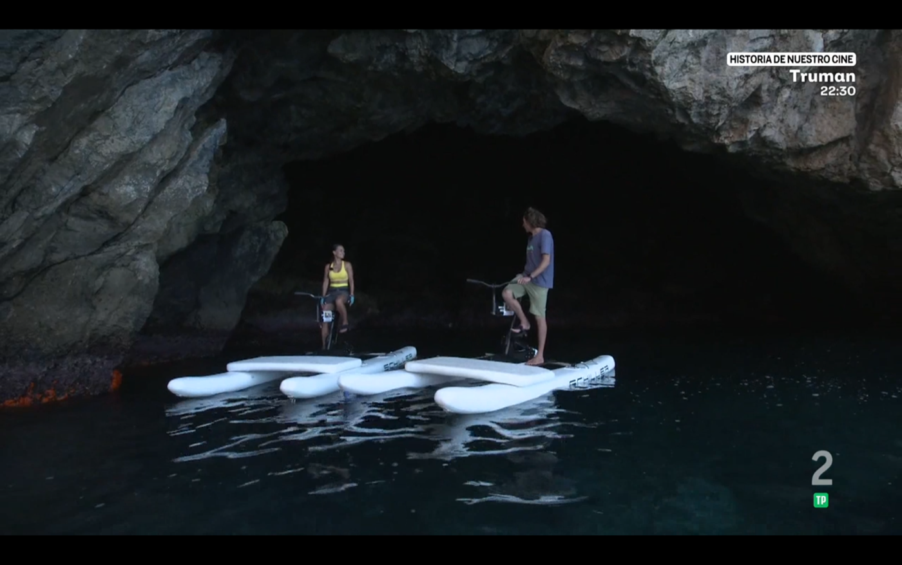
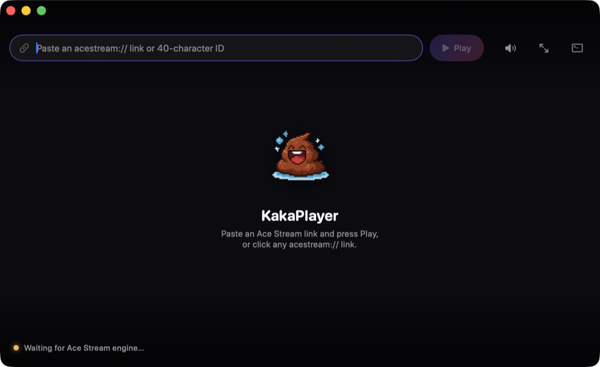

<div align="center">


# KakaPlayer

**A single-app Ace Stream player for Apple Silicon Macs.**
Open an `acestream://` link and it plays. No Docker, no VLC, no extra installs.

[](https://github.com/arsenicoco/kakaplayer/releases/latest)
&nbsp;

&nbsp;




</div>

---

## Why

There has never been a macOS build of the Ace Stream engine — it only exists for
Windows, Linux (x86_64) and Android. Every previous way to watch `acestream://`
links on a Mac meant running the engine in Docker or a Linux VM and pointing VLC
at it by hand. KakaPlayer bundles all of that inside one `.app` so you never see
it.

<div align="center">

</div>

## Install

1. Download `KakaPlayer.dmg` from the [latest release](https://github.com/arsenicoco/kakaplayer/releases/latest).
2. Open it and drag **KakaPlayer** to Applications.
3. First launch: the app isn't notarized, so right-click it → **Open** → **Open**
   (or run `xattr -dr com.apple.quarantine /Applications/KakaPlayer.app`).

The first launch unpacks the engine image (~1 GB on disk) and boots the VM, so
the first channel takes 20–40 seconds. Later launches are fast.

**Requirements:** Apple Silicon Mac on macOS 26 or later.

## Use

- Paste an `acestream://…` link (or a 40-character content ID) and press **Play**.
- Or click any `acestream://` link anywhere — it opens in KakaPlayer.
- During playback the controls fade out when the mouse is idle and return on
  movement; double-click the video (or the ⤢ button) for full screen.

### Keyboard shortcuts

| Key | Action |
|-----|--------|
| `Space` | Play / pause |
| `F` | Full screen |
| `S` | Stop |
| `M` | Mute |
| `↑` / `↓` | Volume up / down |
| `↩` | Play the link in the field |
| `Esc` | Exit full screen |
| `?` | Show / hide the shortcuts cheatsheet |

Single-key shortcuts are ignored while you're typing in the link field, so they
never get in the way of pasting a link.

## iPhone and iPad

There is a companion iOS app. It is a thin client: it has no engine of its own.
The engine keeps running inside KakaPlayer on the Mac, and the phone or iPad
plays the stream over Wi-Fi.

1. On the Mac, turn on **Engine → Share Engine on Local Network**.
2. If macOS's firewall asks, allow incoming connections for KakaPlayer.
3. Keep the Mac awake and on the same Wi-Fi as the phone.
4. Open KakaPlayer on the phone. It finds the Mac automatically over Bonjour —
   or open **Settings** and type `<mac-ip>:6878` by hand. (The first search asks
   for the Local Network permission; if you decline it, re-enable KakaPlayer
   under Settings › Privacy & Security › Local Network.)
5. Paste an `acestream://…` link, or open one from Safari or Messages.

Three things worth knowing:

- The Mac only accepts connections from private network addresses
  (10/8, 172.16/12, 192.168/16). Anything else is refused.
- There is no password in this version. Anyone on your network can use the
  shared engine while the toggle is on.
- The Mac and the phone each start their own engine session, so playing on one
  does not interrupt the other.

### Install on your iPhone or iPad

The app is not on the App Store. Install it from source with Xcode:

```bash
brew install xcodegen
scripts/bootstrap.sh     # fetches VLCKit with the iOS slices, and the rest
cd app && xcodegen generate
open KakaPlayer.xcodeproj
```

In Xcode: select the **KakaPlayerMobile** scheme, add your Apple ID under
**Xcode → Settings → Accounts**, pick your personal team under **Signing &
Capabilities**, plug the device in and press Run. On the phone, trust the
developer under **Settings → General → VPN & Device Management**.

A free Apple ID signs the app for 7 days, after which you re-run it from Xcode
to re-sign. A paid developer account gives you a year.

`scripts/build-ios.sh` builds the same target from the command line — the iOS
Simulator by default, or a device build with a signing team:

```bash
scripts/build-ios.sh                              # simulator
DEVELOPMENT_TEAM=ABCDE12345 scripts/build-ios.sh  # device
```

### Known limitations

- The Mac has to be awake and on the same network; the phone plays nothing on
  its own.
- No remote access outside the LAN. A VPN such as Tailscale works, as long as it
  presents the Mac under a private address.
- Background playback keeps the audio going while a stream is playing; it does
  not start or resume one in the background.
- Lock-screen and call-interruption behaviour has not been tested on a physical
  device yet.

## How it works

```
KakaPlayer.app
├── VLCKit.framework      plays the MPEG-TS stream (H.264/HEVC, AAC/MP2/AC-3, …)
├── gvproxy               user-space networking for the guest
├── vmlinux-arm64         minimal Linux kernel (Kata Containers build)
└── rootfs.img.xz         Ubuntu 22.04 + the official Ace Stream engine 3.2.11
```

The sources are split three ways, so the two apps share one engine client:

```
app/
├── KakaPlayer/          the Mac app: the VM, the engine, the player
├── KakaPlayerMobile/    the iOS app: SwiftUI + VLCKit, Bonjour discovery
└── Shared/              engine client + stream relay, used by both
```

1. A tiny Linux VM boots on Apple's **Virtualization.framework**, with **Rosetta**
   shared in so the x86_64 engine runs on Apple Silicon.
2. The guest exposes the engine's HTTP API to the Mac over **vsock**, so it looks
   exactly like a local Ace Stream install on `127.0.0.1:6878`.
3. A small in-app relay holds a single connection to the engine and fans the
   stream out to the embedded **VLCKit** player.
4. With LAN sharing on, the Mac opens a second listener on the same port for
   private addresses only and advertises itself as `_kakaplayer._tcp` over
   Bonjour, so the iOS app finds it without anyone typing an IP address.

More detail lives in [`engine/README.md`](engine/README.md).

## Build from source

You need an Apple Silicon Mac on macOS 26+ with Xcode 26+, plus
[XcodeGen](https://github.com/yonaskolb/XcodeGen) and, for the engine image only,
Docker (OrbStack or Docker Desktop).

```bash
brew install xcodegen
scripts/bootstrap.sh     # fetch VLCKit, the guest kernel, gvproxy; build the engine image
scripts/build-app.sh     # -> dist/KakaPlayer.app and dist/KakaPlayer.dmg
open dist/KakaPlayer.app
```

`bootstrap.sh` pulls every third-party component straight from its upstream, so
nothing proprietary is stored in this repo. Only the engine-image step needs
Docker, and only at build time.

The iOS client (`KakaPlayerMobile`) is a second target in the same Xcode project
and needs no extra setup — `bootstrap.sh` already fetches the iOS slices of
VLCKit. `scripts/build-ios.sh` builds it for the Simulator, or for a device when
`DEVELOPMENT_TEAM` is set; see
[Install on your iPhone or iPad](#install-on-your-iphone-or-ipad).

To cut a release (builds and publishes the DMG to GitHub):

```bash
scripts/release.sh v0.1.0 "First public build"
```

### Reclaiming disk space

Everything the build produces or fetches is disposable and reproducible, so you
can delete it any time to free space:

- `build/` — Xcode DerivedData, the VLCKit download, the guest kernel, and the
  engine image (several GB).
- `dist/` — the built `.app` and `.dmg` (the DMG also lives on the
  [Releases](https://github.com/arsenicoco/kakaplayer/releases) page).
- The fetched bundle resources under `app/Packages/VLCKitBinary/` and
  `app/KakaPlayer/Resources/` (all gitignored).

```bash
rm -rf build dist        # safe: nothing here is source
```

To rebuild afterwards, run **`scripts/bootstrap.sh` first** — it re-fetches every
third-party component from upstream (VLCKit ≈ 1.3 GB unpacked, now that it
carries the macOS and iOS slices, plus the Kata kernel and gvproxy)
and rebuilds the engine image, then `scripts/build-app.sh` produces the app
again:

```bash
scripts/bootstrap.sh     # re-creates build/ and the bundle resources
scripts/build-app.sh     # -> dist/KakaPlayer.app and dist/KakaPlayer.dmg
```

`bootstrap.sh` is idempotent: it skips any component that's already present, so
it's safe to re-run after a partial cleanup. The engine-image step needs Docker
(OrbStack or Docker Desktop) running.

## Credits

KakaPlayer stands on:

- [VLCKit](https://code.videolan.org/videolan/VLCKit) — playback
- [Ace Stream](https://acestream.org) — the P2P streaming engine
- [gvisor-tap-vsock](https://github.com/containers/gvisor-tap-vsock) — guest networking
- [Kata Containers](https://github.com/kata-containers/kata-containers) — the guest kernel
- Apple's Virtualization.framework and Rosetta

Full licenses and sources are in [THIRD_PARTY_LICENSES.md](THIRD_PARTY_LICENSES.md).

## License

KakaPlayer's own code is [MIT](LICENSE). The packaged app bundles third-party
components under their own licenses — see
[THIRD_PARTY_LICENSES.md](THIRD_PARTY_LICENSES.md).

## Disclaimer

KakaPlayer is an independent client for the Ace Stream engine. It is not
affiliated with or endorsed by Ace Stream, VideoLAN, or Apple. It ships **no**
content, channel lists, or links, and it does not host or index any streams —
it only plays a link you provide. You are responsible for the content you access
and for complying with the Ace Stream User Agreement and the laws of your
country. Some Ace Stream content may require an Ace Stream Premium account.
